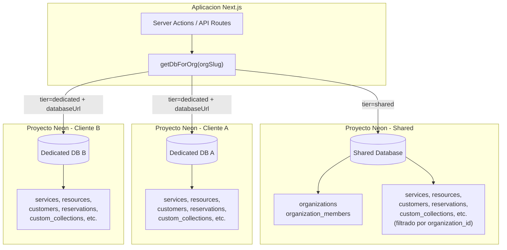
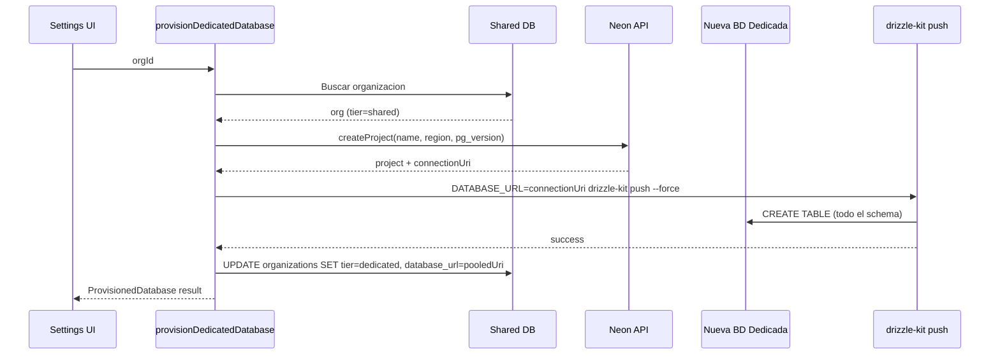
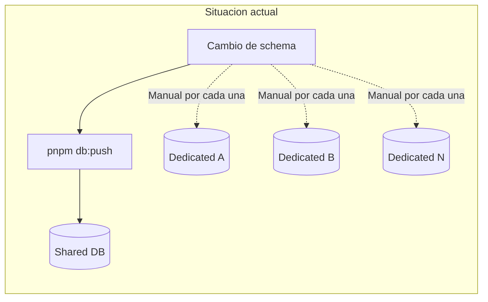
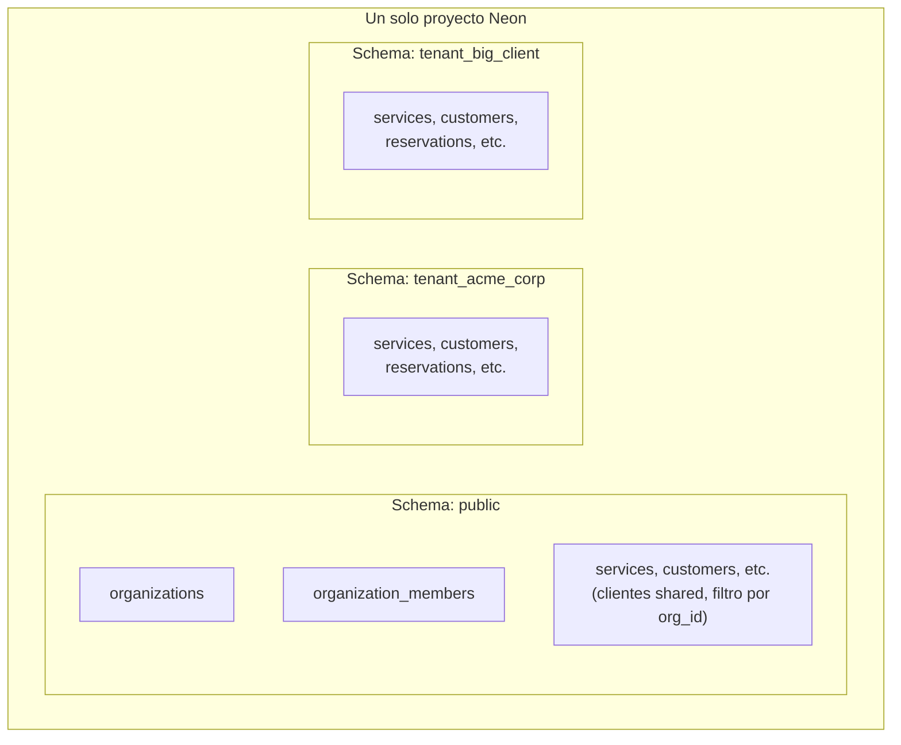
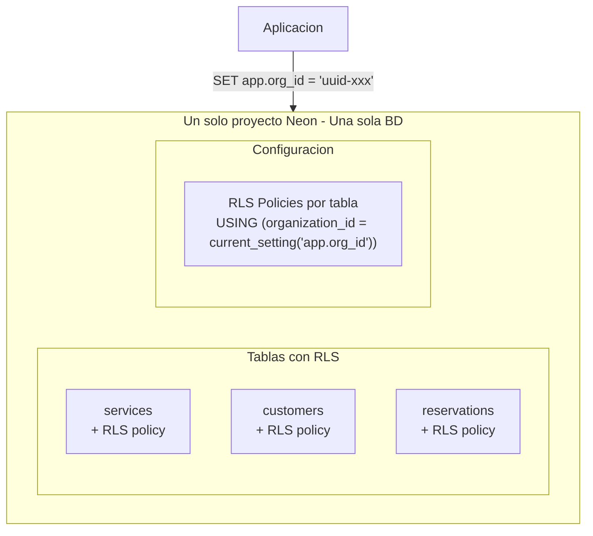
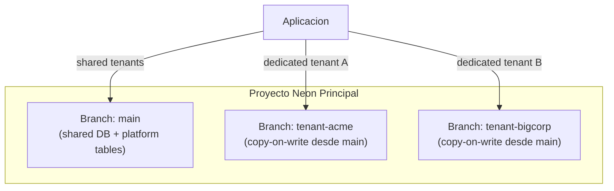
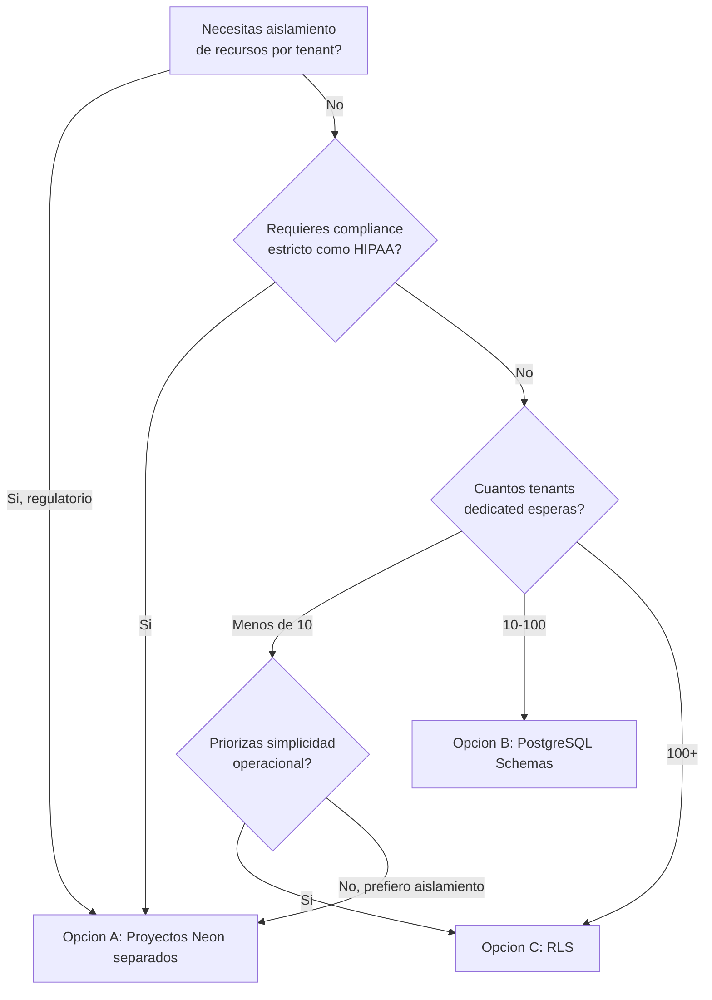

# Analisis de Arquitectura Multi-Tenant con Bases de Datos Dedicadas

> Documento tecnico de analisis para el proyecto ZeroQ AI Agent.
> Fecha: Febrero 2026
> Stack: Next.js 16 + Neon Serverless Postgres + Drizzle ORM

---

## Tabla de contenidos

1. [Arquitectura actual](#1-arquitectura-actual)
2. [Analisis de implicaciones de migraciones](#2-analisis-de-implicaciones-de-migraciones)
3. [Otras implicaciones operacionales](#3-otras-implicaciones-operacionales)
4. [Alternativas arquitecturales](#4-alternativas-arquitecturales)
5. [Matriz comparativa](#5-matriz-comparativa)
6. [Recomendacion](#6-recomendacion)
7. [Plan de accion inmediato](#7-plan-de-accion-inmediato)

---

## 1. Arquitectura actual

### 1.1 Vision general

El sistema implementa una arquitectura multi-tenant de dos niveles:

- **Shared tier**: Una base de datos Neon compartida para clientes low-ticket. El aislamiento se logra a nivel de fila mediante la columna `organization_id` presente en todas las tablas de dominio.
- **Dedicated tier**: Un proyecto Neon independiente por cliente high-ticket. Mismo schema, base de datos completamente separada. Aislamiento total a nivel de infraestructura.



### 1.2 Flujo de resolucion de base de datos

El patron central de la arquitectura es el **smart resolver** en `src/db/index.ts`:

```typescript
// src/db/index.ts - Flujo de resolucion
export const getDbForOrg = async (orgSlug: string): Promise<OrgDbResult> => {
  // 1. SIEMPRE consulta la shared DB para obtener info de la organizacion
  const org = await sharedDb.query.organizations.findFirst({
    where: eq(schema.organizations.slug, orgSlug),
  });

  // 2. Si es dedicated y tiene URL, retorna cliente dedicado
  if (org.tier === "dedicated" && org.databaseUrl) {
    return {
      db: getTenantDb(org.databaseUrl), // Nueva conexion Neon
      orgId: org.id,
      isDedicated: true,
    };
  }

  // 3. Si no, retorna la shared DB
  return { db: sharedDb, orgId: org.id, isDedicated: false };
};
```

Implicaciones de este flujo:

- **Toda request** hace al menos 1 query a la shared DB para resolver la organizacion
- La tabla `organizations` es la **fuente de verdad** para el routing de tenant
- El `databaseUrl` se almacena en texto plano en la shared DB (consideracion de seguridad)
- No hay cache del mapping org -> DB (cada request lo resuelve de nuevo)

### 1.3 Inventario de tablas

El schema Drizzle (`src/db/schema/`) define **10 tablas** organizadas en 3 capas:

| Capa | Tabla | Ubicacion | organization_id |
|------|-------|-----------|-----------------|
| **Platform** | `organizations` | Solo shared DB | N/A (es la tabla raiz) |
| **Platform** | `organization_members` | Solo shared DB | FK a organizations |
| **Dominio** | `services` | Shared + Dedicated | FK a organizations |
| **Dominio** | `resources` | Shared + Dedicated | FK a organizations |
| **Dominio** | `resource_schedules` | Shared + Dedicated | Indirecto via resources |
| **Dominio** | `customers` | Shared + Dedicated | FK a organizations |
| **Dominio** | `reservations` | Shared + Dedicated | FK a organizations |
| **Custom Data** | `custom_collections` | Shared + Dedicated | FK a organizations |
| **Custom Data** | `custom_fields` | Shared + Dedicated | Indirecto via collections |
| **Custom Data** | `custom_records` | Shared + Dedicated | Indirecto via collections |

Adicionalmente se definen **4 enums PostgreSQL** y **10 indices**.

### 1.4 Proceso de provisionamiento

Cuando se crea una BD dedicada (`src/actions/neon-projects.ts`):



Problemas identificados en este flujo:

1. **`drizzle-kit push --force`** es destructivo -- puede borrar columnas/tablas existentes si el schema local difiere
2. **Empuja TODO el schema** incluyendo `organizations` y `organization_members` que nunca se usan en la BD dedicada
3. **Se ejecuta como child process** (`exec`) lo cual tiene implicaciones de seguridad y timeout
4. **Sin versionado**: no hay registro de que version de schema se aplico

### 1.5 Patron de acceso a datos

Todas las server actions tenant-aware siguen el mismo patron:

```typescript
// Patron consistente en todas las actions
const { db, orgId } = await getDbForOrg(orgSlug);

// Queries usan el `db` resuelto
const results = await db.query.services.findMany({
  where: eq(services.organizationId, orgId),
});
```

**Archivos que siguen este patron:**
- `src/actions/services.ts` - getServices, createService, deleteService, etc.
- `src/actions/reservations.ts` - getReservationsWithDetails, createReservation, etc.
- `src/actions/customers.ts` - getCustomers, createCustomer, etc.
- `src/actions/collections.ts` - getCollections, createCollection, bulkImportRecords, etc.

**Archivos que solo usan `sharedDb`:**
- `src/actions/organizations.ts` - CRUD de organizaciones (siempre en shared)
- `src/actions/neon-projects.ts` - Provisionamiento (lee/escribe shared, empuja schema a dedicated)

---

## 2. Analisis de implicaciones de migraciones

Este es el **riesgo operacional mas critico** de la arquitectura actual.

### 2.1 El problema N+1

Cada cambio de schema debe aplicarse a **1 + N** bases de datos:

```
Total de migraciones = 1 (shared DB) + N (dedicated DBs)
```

Donde N es el numero de organizaciones con `tier = "dedicated"`.



**Hoy no existe ningun mecanismo automatizado para aplicar migraciones a las BDs dedicadas post-provisionamiento.** El unico momento en que reciben el schema es durante la creacion (`pushSchemaToDatabase`). Despues de eso, quedan estaticas.

### 2.2 drizzle-kit push vs drizzle-kit migrate

El proyecto usa dos estrategias diferentes:

| | `drizzle-kit push` (actual) | `drizzle-kit migrate` (recomendado) |
|---|---|---|
| **Como funciona** | Compara schema local vs BD remota, aplica diff en vivo | Genera archivos SQL versionados, los aplica en orden |
| **Historial** | No hay registro | Archivos SQL + tabla `__drizzle_migrations` |
| **Destructivo** | Si (`--force` borra columnas/tablas removidas) | No por defecto (cambios destructivos requieren SQL manual) |
| **Rollback** | Imposible | Posible con migracion inversa |
| **Uso en CI/CD** | No recomendado | Estandar de la industria |
| **Donde se usa** | `pushSchemaToDatabase()` en provisionamiento | No implementado |

**Configuracion actual** (`drizzle.config.ts`):

```typescript
export default defineConfig({
  schema: "./src/db/schema/index.ts",
  out: "./drizzle",            // Directorio de migraciones (vacio actualmente)
  dialect: "postgresql",
  dbCredentials: {
    url: process.env.DATABASE_URL!, // Solo la shared DB
  },
});
```

El config **solo apunta a una BD**. No hay forma nativa de apuntar a multiples BDs.

### 2.3 Tablas fantasma en BDs dedicadas

Cuando se ejecuta `drizzle-kit push` contra una nueva BD dedicada, se crean **todas** las tablas del schema, incluyendo:

- `organizations` -- Tabla de plataforma, nunca usada en dedicated
- `organization_members` -- Tabla de plataforma, nunca usada en dedicated

Estas tablas quedan vacias y sin proposito, pero:
- Consumen espacio en el catalogo de PostgreSQL
- Confunden a quien inspeccione la BD
- Las foreign keys de `organization_id` en las tablas de dominio apuntan a `organizations` que esta vacia
- Insertar datos requeriria crear un registro "dummy" en `organizations` para satisfacer las FKs

Esto es un **defecto de diseno**: el schema Drizzle no distingue entre tablas de plataforma y tablas de tenant.

### 2.4 Escenarios de fallo en migraciones

#### Escenario 1: Agregar una columna NOT NULL

```sql
ALTER TABLE reservations ADD COLUMN source TEXT NOT NULL DEFAULT 'manual';
```

- **Shared DB**: Funciona correctamente, `pnpm db:push` lo aplica
- **Dedicated DBs**: No se enteran del cambio
- **Resultado**: El codigo ORM espera la columna `source` pero las dedicated DBs no la tienen
- **Error en runtime**: `column "source" does not exist`

#### Escenario 2: Renombrar una columna

```sql
ALTER TABLE customers RENAME COLUMN phone TO phone_number;
```

- Si `drizzle-kit push --force` se ejecuta en shared pero no en dedicated:
  - Shared DB: columna `phone_number`
  - Dedicated DBs: columna `phone`
  - El ORM genera queries con `phone_number` -- falla en dedicated

#### Escenario 3: Migracion parcial (3/5 BDs migradas)

```
Shared DB:     v5 (migrada)
Dedicated A:   v5 (migrada)
Dedicated B:   v5 (migrada)
Dedicated C:   v4 (FALLO - timeout de red)
Dedicated D:   v4 (no se intento porque C fallo)
```

No hay forma de:
- Saber que C y D estan en v4
- Reintentar solo las fallidas
- Hacer rollback de A y B a v4

#### Escenario 4: Migracion lenta en BD con mucha data

```sql
ALTER TABLE custom_records ADD COLUMN search_vector TSVECTOR;
CREATE INDEX idx_search ON custom_records USING GIN(search_vector);
```

- En la shared DB (miles de registros mixtos): 5 segundos
- En una dedicated BD (un solo cliente con 2M registros): 45 minutos
- El timeout de `pushSchemaToDatabase` es **30 segundos** -- la migracion se cancela a medias

### 2.5 Ausencia de versionado

No existe forma de responder:

- "Que version de schema tiene la BD del cliente X?"
- "Cuantas BDs estan desactualizadas?"
- "Cual fue la ultima migracion aplicada al cliente Y?"

El directorio `drizzle/` (donde irian los archivos de migracion) esta vacio. Drizzle Kit no ha generado ningun archivo de migracion historico.

### 2.6 Consistencia codigo-schema

El ORM Drizzle genera queries en tiempo de compilacion basado en el schema TypeScript. Si una BD no tiene la estructura esperada:

```typescript
// El ORM genera: SELECT id, name, source FROM reservations WHERE ...
// Pero la BD dedicada no tiene la columna "source"
// Resultado: Error de PostgreSQL en runtime
```

No hay mecanismo para:
- Detectar desincronizacion antes de que falle en produccion
- Degradar gracefully (usar valores default si falta una columna)
- Alertar sobre schemas desactualizados

---

## 3. Otras implicaciones operacionales

### 3.1 Backups y recovery

| Aspecto | Shared DB (1 proyecto) | Dedicated DBs (N proyectos) |
|---------|------------------------|------------------------------|
| **PITR** | Un punto de restauracion | N puntos de restauracion independientes |
| **Frecuencia** | Una politica | N politicas (o una por defecto de Neon) |
| **Restauracion** | Restaurar 1 proyecto | Restaurar 1 de N proyectos (puede afectar solo a 1 cliente) |
| **Coordinacion** | N/A | Si se necesita restaurar estado consistente entre shared y dedicated, es manual |
| **Costo** | Incluido en plan Neon | Cada proyecto tiene su propio storage de historial |

**Ventaja real**: Si un cliente dedicado necesita rollback, se puede restaurar su proyecto sin afectar a nadie mas. Esto es una ventaja significativa sobre la shared DB.

**Desventaja**: Si se necesita restaurar un estado consistente entre la shared DB (que tiene el registro de `organizations`) y una dedicated DB (que tiene los datos del tenant), no hay transacciones distribuidas.

### 3.2 Monitoring y observabilidad

Con N proyectos Neon, necesitas monitorear:

- **N+1 dashboards** de metricas en la consola de Neon
- **N+1 conjuntos** de slow queries
- **N+1 alertas** de storage y compute
- **N+1 endpoints** de connection pooling

Herramientas como Neon's SQL monitoring, `pg_stat_statements` y autovacuum settings son **por proyecto**. No hay un panel unificado.

**Recomendacion**: Implementar un sistema centralizado de metricas (e.g., Prometheus + Grafana, o Datadog) que recopile datos de todos los proyectos via la Neon API.

### 3.3 Costos

Cada proyecto Neon tiene costos independientes:

| Componente | Plan Free | Plan Launch | Plan Scale |
|-----------|-----------|-------------|------------|
| Compute | 191.9 hrs/mes | 300 hrs/mes incluidas | 750 hrs/mes incluidas |
| Storage | 0.5 GiB | 10 GiB incluidos | 50 GiB incluidos |
| Proyectos | 1 | 10 | 50 |
| Branches | 10 | 500 | 500 |

**Calculo ejemplo con 10 clientes dedicated**:

- Plan Launch: $19/mes base. Maximo 10 proyectos, asi que 10 clientes dedicated usan todo el cupo.
- Plan Scale: $69/mes base. 50 proyectos disponibles.
- Cada proyecto dedicated que exceda los limites incluidos genera costos adicionales de compute ($0.16/hr) y storage ($0.125/GiB-mes).

**Comparacion**: 10 clientes en la shared DB = 1 proyecto. 10 clientes dedicated = 11 proyectos. El costo de infraestructura se multiplica significativamente.

### 3.4 Conexiones y connection pooling

Cada proyecto Neon tiene su propio connection pooler (PgBouncer integrado):

- **Shared DB**: Un endpoint pooler, todas las conexiones de clientes shared van ahi
- **Dedicated DB**: Un endpoint pooler por proyecto, pero tipicamente con menos conexiones concurrentes

En Next.js con Server Actions (serverless functions):
- Cada invocacion crea una nueva conexion HTTP (gracias a `@neondatabase/serverless`)
- El overhead de crear un cliente `neon()` es minimo (es HTTP, no TCP)
- No hay connection pool en la app (el pooling lo maneja Neon)

**Riesgo**: Si la aplicacion escala a muchos requests concurrentes, cada proyecto dedicated tiene su propio limite de conexiones. El pooler de Neon por defecto soporta hasta 10,000 conexiones por endpoint.

### 3.5 Testing

El codigo debe funcionar identicamente en ambos modos. Hoy no hay tests que verifiquen esto.

Escenarios criticos a testear:

1. **Misma query, diferente DB**: `getDbForOrg("shared-org")` vs `getDbForOrg("dedicated-org")` deben retornar los mismos resultados estructuralmente
2. **Foreign keys en dedicated**: `organization_id` en tablas de dominio referencia a `organizations` que esta vacia en la dedicated DB -- las inserciones fallan?
3. **Enums**: Los enums PostgreSQL (`organization_tier`, `reservation_status`, etc.) deben existir en ambas BDs
4. **Indices**: Los indices creados en la shared DB deben existir identicos en las dedicated

### 3.6 Seed y datos de prueba

El seed actual (`src/db/seed.ts`) solo funciona contra `DATABASE_URL` (shared DB). No hay forma de:

- Seedear una BD dedicada para testing
- Crear datos de prueba en el modo "como si fuera dedicated"
- Migrar datos de shared a dedicated cuando un cliente hace upgrade

---

## 4. Alternativas arquitecturales

### 4.1 Opcion A: Arquitectura actual mejorada

**Concepto**: Mantener el modelo de proyectos Neon separados pero agregar el tooling necesario para operarlo en produccion.

**Cambios necesarios:**

1. **Script `db:migrate:all`**: Itera sobre todas las organizaciones dedicated y aplica migraciones

```typescript
// Pseudocodigo del script
const dedicatedOrgs = await sharedDb.query.organizations.findMany({
  where: eq(organizations.tier, "dedicated"),
});

for (const org of dedicatedOrgs) {
  try {
    await runMigration(org.databaseUrl, latestMigrationFiles);
    await updateSchemaVersion(org.id, version);
  } catch (error) {
    logFailure(org.id, error);
    // Continua con la siguiente o aborta segun politica
  }
}
```

2. **Tabla `schema_versions`** en la shared DB:

```sql
CREATE TABLE schema_versions (
  id UUID DEFAULT gen_random_uuid() PRIMARY KEY,
  organization_id UUID REFERENCES organizations(id),
  version TEXT NOT NULL,          -- e.g., "0005_add_source_column"
  applied_at TIMESTAMPTZ DEFAULT NOW(),
  status TEXT NOT NULL,           -- 'success', 'failed', 'pending'
  error_message TEXT,
  execution_time_ms INTEGER
);
```

3. **Separar schema en platform vs tenant**:

```
src/db/schema/
  platform/           -- Solo para shared DB
    organizations.ts
    organization-members.ts
    schema-versions.ts
  tenant/             -- Para shared y dedicated DBs
    services.ts
    resources.ts
    customers.ts
    reservations.ts
    custom-data.ts
  index.ts            -- Exporta todo (para shared DB)
  tenant-index.ts     -- Solo exporta tenant (para dedicated DBs)
```

4. **Drizzle config dual**:

```typescript
// drizzle.config.ts (shared DB - schema completo)
export default defineConfig({
  schema: "./src/db/schema/index.ts",
  out: "./drizzle/shared",
  // ...
});

// drizzle.tenant.config.ts (dedicated DBs - solo tenant)
export default defineConfig({
  schema: "./src/db/schema/tenant-index.ts",
  out: "./drizzle/tenant",
  // ...
});
```

**Pros:**
- Maximo aislamiento de datos (BD separada por cliente)
- Maximo aislamiento de recursos (compute y storage separados)
- Ya esta implementado (requiere mejoras, no reescritura)
- Permite escalar recursos por cliente individualmente
- Backup/restore granular por cliente
- Si un cliente tiene un spike de carga, no afecta a otros

**Contras:**
- Complejidad operacional O(N) para migraciones
- Costo de infraestructura se multiplica por N
- Necesita tooling custom para operar
- Monitoring distribuido
- Testing complejo (debe funcionar en ambos modos)
- Coordinar migraciones distribuidas sin transacciones distribuidas

**Complejidad de implementacion**: Media (2-3 semanas para el tooling basico)

---

### 4.2 Opcion B: PostgreSQL Schemas

**Concepto**: En lugar de proyectos Neon separados, usar `CREATE SCHEMA` de PostgreSQL para aislar tenants dentro de **un solo proyecto Neon**.



**Como funcionaria:**

```typescript
// Crear schema para nuevo tenant dedicated
await db.execute(sql`CREATE SCHEMA IF NOT EXISTS ${sql.raw(`tenant_${org.slug}`)}`);

// Aplicar migraciones al schema
await db.execute(sql`SET search_path TO ${sql.raw(`tenant_${org.slug}`)}`);
// ... crear tablas ...

// Resolver DB para un tenant
export const getDbForOrg = async (orgSlug: string) => {
  const org = await sharedDb.query.organizations.findFirst({/*...*/});

  if (org.tier === "dedicated") {
    // Mismo proyecto, diferente schema
    const tenantSql = neon(process.env.DATABASE_URL!);
    const tenantDb = drizzle({ client: tenantSql, schema: tenantSchema });
    // SET search_path antes de cada query
    return { db: tenantDb, orgId: org.id, isDedicated: true };
  }

  return { db: sharedDb, orgId: org.id, isDedicated: false };
};
```

**Migraciones:**

```sql
-- Una sola BD, pero aplicar por schema
DO $$
DECLARE
  schema_name TEXT;
BEGIN
  -- Migrar public (shared)
  SET search_path TO public;
  ALTER TABLE reservations ADD COLUMN source TEXT DEFAULT 'manual';

  -- Migrar cada tenant schema
  FOR schema_name IN
    SELECT slug FROM organizations WHERE tier = 'dedicated'
  LOOP
    EXECUTE format('SET search_path TO tenant_%I', schema_name);
    EXECUTE 'ALTER TABLE reservations ADD COLUMN source TEXT DEFAULT ''manual''';
  END LOOP;
END $$;
```

**Pros:**
- **Una sola BD para migrar** (simplifica enormemente las operaciones)
- Aislamiento logico (datos separados por schema)
- Un solo proyecto Neon (costo fijo)
- Un solo connection pooler
- Un solo dashboard de monitoring
- Backup/PITR unificado
- Drizzle ORM soporta `schema` en la definicion de tablas
- Las migraciones se pueden ejecutar en una transaccion (atomicidad)

**Contras:**
- **Sin aislamiento de recursos**: Un tenant pesado puede degradar performance para todos
- Limites del proyecto Neon aplican a todos los tenants juntos
- Complejidad en el ORM para manejar `search_path` dinamico
- Drizzle no tiene soporte nativo para cambiar schemas en runtime de forma transparente
- Si se corrompe el proyecto Neon, **todos** los tenants se ven afectados
- Backup granular por tenant es mas complejo (pg_dump con schema filter)
- Limites de PostgreSQL en numero de schemas (practico: ~10,000)

**Complejidad de implementacion**: Media-Alta (3-4 semanas -- requiere reescribir el patron de acceso a datos y el manejo de search_path)

---

### 4.3 Opcion C: Row-Level Security (RLS)

**Concepto**: Eliminar completamente las BDs dedicadas. Todos los tenants en una sola BD con RLS de PostgreSQL para garantizar aislamiento.



**Como funcionaria:**

```sql
-- Habilitar RLS en cada tabla de dominio
ALTER TABLE services ENABLE ROW LEVEL SECURITY;

-- Crear policy
CREATE POLICY tenant_isolation ON services
  USING (organization_id = current_setting('app.current_org_id')::uuid);

-- La aplicacion setea el org_id antes de cada query
SET app.current_org_id = 'uuid-de-la-org';
SELECT * FROM services; -- Solo retorna los de esa org
```

```typescript
// En el codigo de la app
export const getDbForOrg = async (orgSlug: string) => {
  const org = await sharedDb.query.organizations.findFirst({/*...*/});

  // Setear el org_id en la sesion de PostgreSQL
  await db.execute(sql`SET app.current_org_id = ${org.id}`);

  return { db: sharedDb, orgId: org.id, isDedicated: false };
};
```

**Migraciones:**

```bash
# Una sola BD, una sola migracion, listo
pnpm db:migrate
```

**Pros:**
- **Migraciones triviales**: Una sola BD, un solo comando
- Aislamiento garantizado por el motor de BD (no depende del codigo de la app)
- Costo minimo (un solo proyecto Neon)
- Monitoring centralizado
- Patron maduro usado por Supabase, Citus, y muchos SaaS
- Backup/PITR unificado
- No hay "tablas fantasma"
- Simplifica drasticamente el codigo de la aplicacion

**Contras:**
- **Sin aislamiento de recursos**: CPU, memoria, storage compartidos
- Un error en una RLS policy puede exponer datos de otros tenants
- Performance puede degradar con muchos tenants y datos (indices son globales)
- No se puede escalar recursos por tenant individual
- Mas dificil de testear las policies RLS correctamente
- Si un tenant genera queries pesadas, afecta a todos
- Drizzle ORM no tiene soporte nativo para RLS; requiere `execute(sql\`SET...\`)` manual
- Para clientes que exigen aislamiento regulatorio (HIPAA, SOC2), puede no ser suficiente

**Complejidad de implementacion**: Media (2-3 semanas -- crear policies RLS, modificar getDbForOrg, eliminar logica de dedicated)

---

### 4.4 Opcion D: Hibrida con Neon Branches

**Concepto**: Usar branches de Neon en lugar de proyectos separados. Un solo proyecto, un branch por tenant high-ticket.



**Como funcionaria:**

```typescript
// Crear branch para nuevo tenant
const branch = await neonApi.createProjectBranch(projectId, {
  branch: { name: `tenant-${org.slug}` },
  endpoints: [{ type: "read_write" }],
});

// El branch hereda schema y datos del parent (copy-on-write)
// Pero diverge a partir de la creacion

// Cada branch tiene su propio endpoint/connection string
const branchConnectionUri = branch.endpoints[0].connection_uri;
```

**Migraciones:**

```bash
# Migrar main branch
pnpm db:migrate

# Cada tenant branch necesita su propia migracion
# (los branches NO heredan cambios del parent despues de creacion)
```

**Pros:**
- Un solo proyecto Neon (un plan de billing)
- Creacion instantanea (copy-on-write, no copia datos)
- Cada branch tiene su propio endpoint de conexion
- Storage eficiente (solo almacena los cambios vs main)
- Neon soporta hasta 500 branches por proyecto (plan Launch/Scale)

**Contras:**
- **Neon no recomienda branches para produccion long-lived** -- estan disenados para dev/preview
- Los branches **no heredan cambios del parent** despues de la creacion (mismo problema de migracion N+1)
- No hay aislamiento de compute real (los branches comparten el compute del proyecto)
- El storage de branches se acumula (diff vs parent)
- Si se hace reset del branch, se pierden los datos del tenant
- La documentacion de Neon explicitamente dice: "Branches are designed for development and testing workflows"
- Soporte limitado y comportamiento no garantizado para workloads de produccion

**Complejidad de implementacion**: Baja (1-2 semanas -- similar a la actual, pero cambiando createProject por createProjectBranch)

**Veredicto**: **No recomendada para produccion** dado que Neon no soporta oficialmente este uso.

---

## 5. Matriz comparativa

### 5.1 Comparacion por criterio

| Criterio | A: Proyectos Neon | B: PG Schemas | C: RLS | D: Branches |
|----------|:------------------:|:-------------:|:------:|:-----------:|
| **Complejidad de migracion** | Alta (N+1) | Baja-Media (1 BD, N schemas) | Minima (1 BD) | Alta (N+1 branches) |
| **Aislamiento de datos** | Total | Alto | Alto (si RLS correcto) | Alto |
| **Aislamiento de recursos** | Total | Nulo | Nulo | Parcial |
| **Costo (10 tenants)** | ~$190/mes | ~$19-69/mes | ~$19-69/mes | ~$19-69/mes |
| **Costo (50 tenants)** | ~$800+/mes | ~$69-200/mes | ~$69-200/mes | ~$69-200/mes |
| **Escalabilidad** | Lineal (1 proyecto por tenant) | Hasta ~10K schemas | Limitada por tamano de BD | Hasta 500 branches |
| **Complejidad operacional** | Alta | Media | Baja | Alta |
| **Recovery granular** | Excelente (por proyecto) | Media (pg_dump por schema) | Baja (toda la BD o nada) | Media (por branch) |
| **Compliance (HIPAA/SOC2)** | Excelente | Media | Baja-Media | Media |
| **Time to implement** | Ya implementado | 3-4 semanas | 2-3 semanas | 1-2 semanas |
| **Riesgo de data leak** | Nulo (BD separada) | Bajo (schema separado) | Medio (depende de RLS) | Bajo |
| **Soporte de Neon** | Oficial | Oficial | Oficial | No recomendado para prod |

### 5.2 Comparacion de impacto en migraciones (detalle)

| Escenario | A: Proyectos | B: Schemas | C: RLS |
|-----------|:------------:|:----------:|:------:|
| Agregar columna nullable | N+1 comandos | 1 transaccion (N+1 ALTER) | 1 comando |
| Agregar columna NOT NULL | N+1 comandos + riesgo de fallo | 1 transaccion | 1 comando |
| Crear tabla nueva | N+1 comandos | 1 transaccion (N+1 CREATE) | 1 comando |
| Agregar indice | N+1 comandos (tiempo variable) | N+1 CREATE INDEX (misma BD) | 1 comando |
| Cambiar tipo de columna | N+1 comandos (puede requerir rewrite) | 1 transaccion | 1 comando |
| Renombrar columna | N+1 comandos | 1 transaccion | 1 comando |
| Rollback de migracion | N+1 rollbacks manuales | 1 ROLLBACK | 1 ROLLBACK |
| Verificar consistencia | Query N+1 BDs | Query 1 BD, N+1 schemas | Query 1 tabla |

### 5.3 Decision tree



---

## 6. Recomendacion

### 6.1 Contexto del proyecto

- **Etapa**: MVP / Prueba de concepto
- **Clientes dedicated esperados a corto plazo**: 0-5
- **Stack**: Next.js (serverless) + Neon + Drizzle
- **Equipo**: Pequeno (1-3 desarrolladores)
- **Regulacion**: No mencionada (asumimos no-HIPAA)
- **Prioridad**: Velocidad de desarrollo > escalabilidad operacional

### 6.2 Recomendacion por horizonte temporal

#### Corto plazo (MVP, 0-5 clientes dedicated): Opcion A mejorada

**Justificacion**: Ya esta implementado. El costo de reescribir ahora no se justifica para 0-5 clientes. Pero se necesita el tooling minimo para no quedar bloqueados.

**Acciones minimas**:
1. Crear script `db:migrate:all` (ver seccion 7)
2. Agregar tabla `schema_versions`
3. Separar schema platform vs tenant
4. Cambiar `drizzle-kit push` por `drizzle-kit migrate` con archivos versionados

#### Mediano plazo (10-50 clientes dedicated): Evaluar Opcion B o C

**Justificacion**: Con 10+ proyectos Neon, los costos y la complejidad operacional escalan linealmente. Si el equipo es pequeno, mantener N+1 BDs se vuelve insostenible.

**Decision point**: Si para ese momento:
- Se necesita aislamiento de recursos -> Mantener Opcion A con mejor tooling
- No se necesita aislamiento de recursos -> Migrar a Opcion B (schemas) o C (RLS)

#### Largo plazo (50+ clientes dedicated): Opcion C con read replicas

**Justificacion**: A escala, RLS es el patron mas probado. Neon soporta read replicas que pueden ayudar a distribuir carga para tenants pesados.

**Modelo hibrido posible**: RLS para todos + read replicas dedicadas para clientes que necesiten performance garantizada.

### 6.3 Lo que NO recomiendo

- **Opcion D (Branches)**: Neon no soporta branches para produccion long-lived. Es un riesgo innecesario.
- **Mantener la Opcion A sin mejoras**: El estado actual (sin versionado, sin script de migracion, con tablas fantasma) **va a causar incidentes** en cuanto haya mas de 1 BD dedicated y se haga un cambio de schema.
- **Reescribir ahora a Opcion B o C**: El costo de reescritura no se justifica en etapa MVP con 0 clientes dedicated reales.

---

## 7. Plan de accion inmediato

Si se decide mantener la Opcion A (recomendado para el corto plazo), estos son los cambios minimos necesarios:

### 7.1 Crear tabla `schema_versions`

Agregar al schema Drizzle:

```typescript
// src/db/schema/platform/schema-versions.ts
export const schemaVersions = pgTable("schema_versions", {
  id: uuid("id").defaultRandom().primaryKey(),
  organizationId: uuid("organization_id")
    .references(() => organizations.id, { onDelete: "cascade" }),
  version: text("version").notNull(),
  appliedAt: timestamp("applied_at", { withTimezone: true }).notNull().defaultNow(),
  status: text("status").notNull(), // 'success' | 'failed' | 'pending'
  errorMessage: text("error_message"),
  executionTimeMs: integer("execution_time_ms"),
});
```

### 7.2 Separar schema platform vs tenant

Crear dos puntos de entrada:

```
src/db/schema/
  index.ts              # Exporta TODO (para shared DB)
  tenant-schema.ts      # Solo tablas de dominio (para dedicated DBs)
```

Y un segundo config de Drizzle:

```typescript
// drizzle.tenant.config.ts
export default defineConfig({
  schema: "./src/db/schema/tenant-schema.ts",
  out: "./drizzle/tenant",
  dialect: "postgresql",
  dbCredentials: {
    url: process.env.DATABASE_URL!, // Se sobreescribe en runtime
  },
});
```

### 7.3 Script `db:migrate:all`

```typescript
// scripts/migrate-all.ts
import { sharedDb } from "@/src/db";
import { organizations, schemaVersions } from "@/src/db/schema";
import { eq } from "drizzle-orm";
import { exec } from "child_process";
import { promisify } from "util";

const execAsync = promisify(exec);

const migrateAll = async () => {
  // 1. Migrar shared DB
  console.log("Migrando shared DB...");
  await execAsync("pnpm db:migrate");
  console.log("Shared DB migrada.");

  // 2. Obtener todas las orgs dedicated
  const dedicatedOrgs = await sharedDb.query.organizations.findMany({
    where: eq(organizations.tier, "dedicated"),
  });

  console.log(`Encontradas ${dedicatedOrgs.length} BDs dedicadas.`);

  // 3. Migrar cada una
  const results = [];
  for (const org of dedicatedOrgs) {
    if (!org.databaseUrl) continue;

    const startTime = Date.now();
    try {
      await execAsync(
        `DATABASE_URL="${org.databaseUrl}" npx drizzle-kit migrate --config=drizzle.tenant.config.ts`,
        { timeout: 120_000 }
      );

      const elapsed = Date.now() - startTime;
      await sharedDb.insert(schemaVersions).values({
        organizationId: org.id,
        version: "latest", // Idealmente leer del archivo de migracion
        status: "success",
        executionTimeMs: elapsed,
      });

      results.push({ org: org.slug, status: "success", time: elapsed });
    } catch (error) {
      const elapsed = Date.now() - startTime;
      await sharedDb.insert(schemaVersions).values({
        organizationId: org.id,
        version: "latest",
        status: "failed",
        errorMessage: error instanceof Error ? error.message : "Unknown error",
        executionTimeMs: elapsed,
      });

      results.push({ org: org.slug, status: "failed", error });
    }
  }

  // 4. Resumen
  console.table(results);

  const failed = results.filter(r => r.status === "failed");
  if (failed.length > 0) {
    console.error(`${failed.length} migraciones fallaron.`);
    process.exit(1);
  }
};

migrateAll();
```

### 7.4 Pipeline de migraciones

```
package.json scripts:
  "db:migrate":      "drizzle-kit migrate"                    # Solo shared DB
  "db:migrate:all":  "npx tsx scripts/migrate-all.ts"         # Shared + todas las dedicated
  "db:generate":     "drizzle-kit generate"                   # Genera archivos de migracion
  "db:status":       "npx tsx scripts/migration-status.ts"    # Muestra estado de cada BD
```

### 7.5 Actualizar provisionamiento

Modificar `pushSchemaToDatabase` para:

1. Usar `drizzle-kit migrate` en lugar de `drizzle-kit push --force`
2. Usar el config de tenant (`drizzle.tenant.config.ts`) para no crear tablas de plataforma
3. Registrar la version inicial en `schema_versions`

### 7.6 Checklist de implementacion

- [ ] Crear tabla `schema_versions` en el schema Drizzle
- [ ] Separar schema en `index.ts` (full) y `tenant-schema.ts` (solo dominio)
- [ ] Crear `drizzle.tenant.config.ts`
- [ ] Crear `scripts/migrate-all.ts`
- [ ] Crear `scripts/migration-status.ts`
- [ ] Modificar `pushSchemaToDatabase` para usar migrate + tenant config
- [ ] Agregar scripts a `package.json`
- [ ] Generar primera migracion con `drizzle-kit generate`
- [ ] Documentar proceso de migracion en README

---

## Apendice A: Referencias

- [Neon Documentation - Multi-tenancy](https://neon.tech/docs/guides/multi-tenant)
- [Drizzle ORM - Migrations](https://orm.drizzle.team/docs/migrations)
- [Drizzle ORM - Multiple Schemas](https://orm.drizzle.team/docs/schemas)
- [PostgreSQL - Row Level Security](https://www.postgresql.org/docs/current/ddl-rowsecurity.html)
- [PostgreSQL - Schema Management](https://www.postgresql.org/docs/current/ddl-schemas.html)
- [Neon - Branching](https://neon.tech/docs/introduction/branching)
- [Neon - Connection Pooling](https://neon.tech/docs/connect/connection-pooling)

## Apendice B: Glosario

| Termino | Definicion |
|---------|-----------|
| **Shared DB** | Base de datos compartida entre multiples organizaciones low-ticket |
| **Dedicated DB** | Proyecto Neon independiente para un solo cliente high-ticket |
| **Tenant** | Una organizacion/cliente del SaaS |
| **RLS** | Row-Level Security - mecanismo nativo de PostgreSQL para filtrar filas por politica |
| **PITR** | Point-In-Time Recovery - restauracion de BD a un momento especifico |
| **Schema (PostgreSQL)** | Namespace dentro de una BD que agrupa tablas (no confundir con "schema" de Drizzle) |
| **Branch (Neon)** | Copia copy-on-write de una BD dentro del mismo proyecto Neon |
| **Connection Pooler** | Proxy (PgBouncer) que reutiliza conexiones TCP a PostgreSQL |
